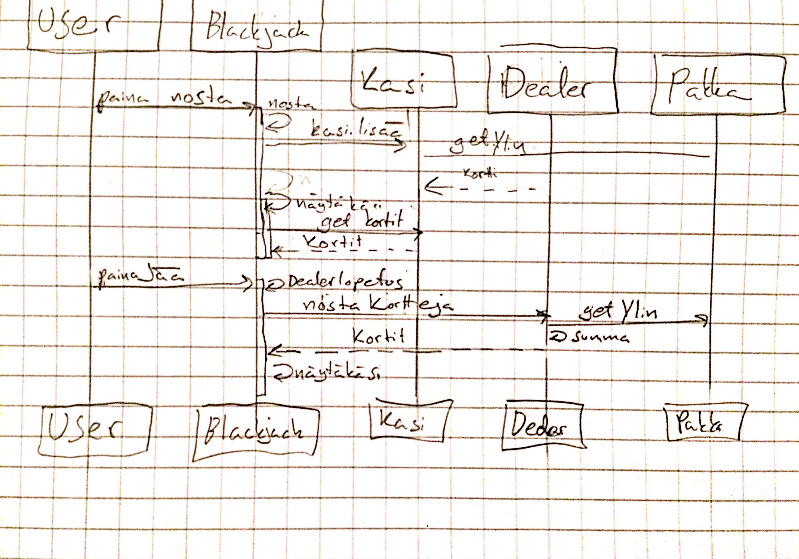

## Ohjelman Perusrakenne

Ohjelman perusrakenne on seuraava:

## Käyttöliittymä

käyttöliittymässä on kaksi näkymää.

* Kirjautuminen
* Pelinäkymä

Molemmat näistä on omia Scene-olioita.
Käyttöliittymää on yritetty eriyttää sovelluslogiikasta niin paljon, kuin sen saa käytännöllisesti toteutettua.

## Sovelluslogiikka

Pelinäkymässä peli luo olion käsi, dealer, pakka ja se ottaa tietokannan luvuilla olion pelaaja. Suurin osa työstä on oliolla Käsi joka huolehtii käden toiminnasta. Luokka Pelaaja huolehtii tietokannan ja Ui yhteispelistä. Pakka huolehtii korteista, joita se jakelee dealerille ja kädelle kun nämä luokat kutsuvat niitä.

## Tietojen pysyväistallennus

Pelissä on tietokanta, joka tallentaa sisäänsä pelaajia ja heidän rahamääriä. Jos pelin kanssa samassa kansiossa ei ole tietokantaa niin peli luo sen itse.

## Päätoiminnallisuudet

