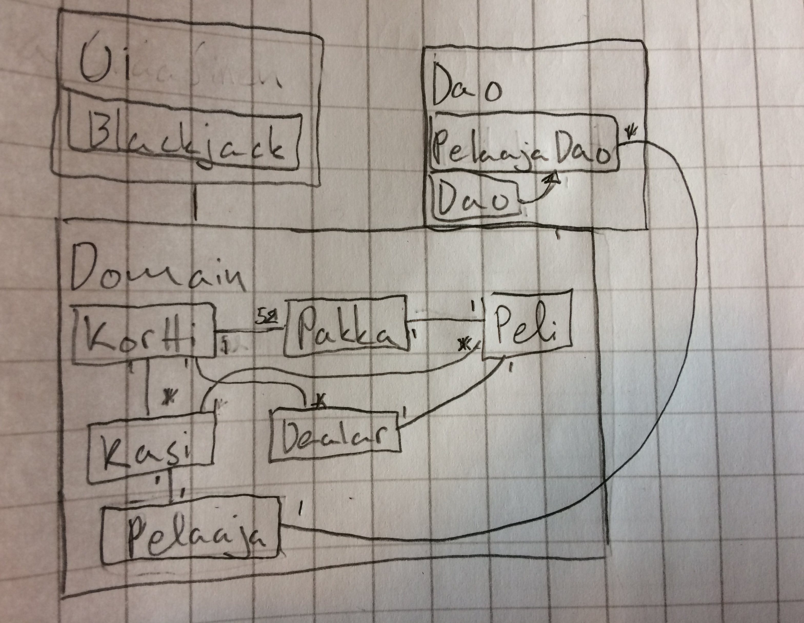

## Ohjelman Perusrakenne

Ohjelman perusrakenne on seuraava:

## Käyttöliittymä

käyttöliittymässä on kaksi näkymää.

* Kirjautuminen
* Pelinäkymä

Molemmat näistä on omia Scene-olioita.
Käyttöliittymää on yritetty eriyttää sovelluslogiikasta niin paljon, kuin sen saa käytännöllisesti toteutettua.

## Sovelluslogiikka

## Tietojen pysyväistallennus

Pelissä on tietokanta, joka tallentaa sisäänsä pelaajia ja heidän rahamääriä.

## Päätoiminnallisuudet

